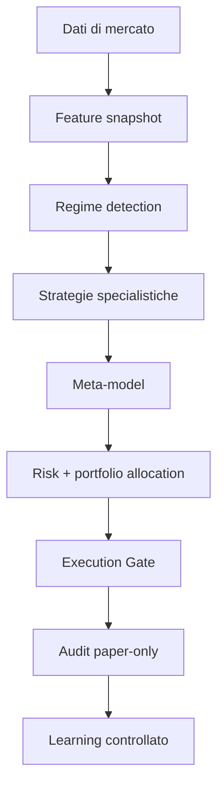

# TradingAI — Adaptive Multi-Market Intelligence System

## Stato della fondazione

Questa prima versione trasforma il progetto da pipeline lineare a piattaforma
modulare e verificabile. È progettata per ricerca e paper trading: non apre,
modifica o chiude posizioni presso un broker.

Il risultato `PAPER_APPROVED` è un candidato economico, non un ordine. La
promozione futura a un ambiente broker sandbox dovrà essere un progetto
separato, con approvazione manuale, test walk-forward e limiti di capitale.



## Componenti implementati

| Componente | Responsabilità | Garanzia prudenziale |
|---|---|---|
| `models.py` | Contratti immutabili per feature, previsioni e decisioni | Valida range, segni, ticker e valori non finiti |
| `feature_engine.py` | Rendimenti, volatilità, trend, z-score, shock, volume, spread, liquidità e correlazione opzionale | Usa soltanto dati disponibili fino allo snapshot |
| `regime_detector.py` | Probabilità relative di trend, range, volatilità, shock, correlazione e crisi di liquidità | Può azzerare il rischio prima delle strategie |
| `strategies.py` | Trend, mean reversion e volatility breakout indipendenti | Ogni modello può restituire `FLAT` |
| `meta_model.py` | Aggrega segnali per affidabilità, regime e performance osservata | Il default è `NO_TRADE`; i conflitti non diventano operazioni |
| `risk_engine.py` | Vol targeting, limiti per asset/classe/gross, correlazione, liquidità, eventi e drawdown | Ha autorità superiore; kill switch al drawdown configurato |
| `portfolio_allocator.py` | Ordina i candidati e applica limiti cumulativi gross, netti, per asset e classe | Un candidato escluso non modifica la posizione corrente |
| `news_intelligence.py` | Pesa evento, novità, fonte, latenza e reazione market-adjusted | Ignora eventi futuri; le contraddizioni prezzo/testo aumentano il rischio |
| `execution_gate.py` | Spread, fee, slippage, impatto, partecipazione, latenza e freschezza dati | Rifiuta l'operazione se l'edge netto non copre i costi |
| `journal.py` | Audit trail SQLite di snapshot, previsioni, decisioni e outcome | Solo record con outcome entrano nel dataset di apprendimento |
| `learning.py` | Pesi online limitati per strategia | Nessuna modifica automatica al codice; passo e range dei pesi sono limitati |
| `orchestrator.py` | Ciclo end-to-end e scansione di un universo | Isola gli errori per modello e ticker; resta sempre paper-only |

La vecchia pipeline è stata inoltre corretta: una decisione `WAIT` non viene
più trasformata artificialmente in `BUY`.

## Stati decisionali

| Stato | Significato |
|---|---|
| `NO_TRADE` | Nessun edge affidabile o modelli in conflitto |
| `RISK_REJECTED` | Segnale presente, ma il Risk Engine ne vieta l'esposizione |
| `EXECUTION_REJECTED` | Rischio accettabile, ma costi o condizioni di esecuzione annullano l'edge |
| `PAPER_APPROVED` | Candidato registrato per simulazione; nessun ordine reale |

Nella scansione di universo, i candidati `PAPER_APPROVED` attraversano inoltre
l'allocatore cross-asset. Se il capitale residuo o un limite di classe non è
sufficiente, lo scanner mostra `ALLOCATION_REJECTED` e target zero senza
modificare l'eventuale posizione corrente.

## Apprendimento controllato

Ogni ciclo viene registrato con snapshot, regime, forecast, meta-decisione,
target rischio, stima dei costi ed eventuali errori degli specialisti. I pesi
si aggiornano soltanto dopo `record_outcome`, usando il rendimento realmente
osservato al netto di costi e slippage.

L'aggiornamento è intenzionalmente limitato:

- peso per strategia compreso tra `0.50` e `1.50`;
- variazione massima per osservazione pari a `0.05`;
- nessuna riscrittura del codice;
- nessuna promozione automatica di un nuovo modello;
- nessun training su decisioni prive di outcome.

Per una futura promozione serviranno almeno confronto contro benchmark,
purged walk-forward, costi stressati, stabilità per regime e verifica su un
periodo out-of-sample mai usato nella selezione.

## Uso

Eseguire tutti i test:

```powershell
python -m pytest -q
```

Eseguire lo scanner paper-only:

```powershell
python -m adaptive.run_adaptive_scan --period 1y --interval 1d --tickers SPY QQQ IWM EFA EEM SHY IEF TLT GLD SLV USO DBA UUP FXE FXY
```

Lo scanner accetta anche ticker Yahoo esterni all'universo predefinito. Gli
asset sconosciuti vengono classificati come `EQUITY`; le coppie `-USD` come
crypto e i simboli `=X` come forex.

## Limiti attuali, dichiarati

Questa è la fondazione architetturale, non il sistema finale da migliaia di
strumenti in tempo reale.

- Yahoo Finance fornisce qui dati storici e può applicare rate limit; non è un
  feed real-time garantito.
- Bid/ask, order book, volatilità implicita, macro e notizie non vengono ancora
  acquisiti automaticamente. Le news già classificate possono però attraversare
  il motore di credibilità, novità, latenza e reazione del prezzo.
- La scansione è sequenziale; per migliaia di asset serviranno code asincrone,
  caching, data quality monitoring e provider professionali con licenze adatte.
- Sono attivi tre specialisti iniziali. Cross-sectional momentum, statistical
  arbitrage, relative value, event-driven, NLP e microstruttura verranno
  aggiunti come modelli separati con propri test out-of-sample.
- Il modello dei costi è una stima prudenziale, non una tariffa garantita di un
  broker.
- Nessun risultato storico può garantire rendimenti futuri.

## Roadmap tecnica

1. Backtester event-driven per l'intero orchestratore, con walk-forward e
   confronto tra modelli/regimi.
2. Data gateway asincrono con cache, retry, timestamp UTC, controlli di qualità
   e provider separati per azioni, forex e crypto.
3. Motore di correlazione di portafoglio e allocatore cross-sectional.
4. News intelligence con entità, evento, novità, fonte e reazione del prezzo.
5. Strategie aggiuntive promosse una alla volta dopo test indipendenti.
6. Dashboard di monitoraggio, model drift e kill switch operativo.
7. Solo in seguito: broker sandbox isolato, permessi minimi e approvazione
   manuale prima di qualsiasi sperimentazione con capitale reale.

## Riferimenti di progetto

- James Hamilton, [Regime Changes and Financial Markets](https://www.nber.org/system/files/working_papers/w17182/w17182.pdf).
- Robert Almgren e Neil Chriss, [Optimal Execution of Portfolio Transactions](https://www.smallake.kr/wp-content/uploads/2016/03/optliq.pdf).
- Reza Karimi e Andreas Krause, [Online Model Selection](https://www.jmlr.org/papers/volume25/22-0803/22-0803.pdf).
